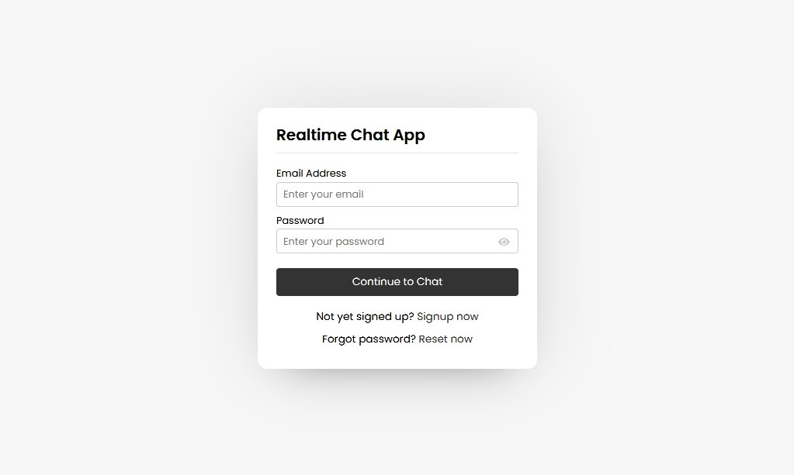
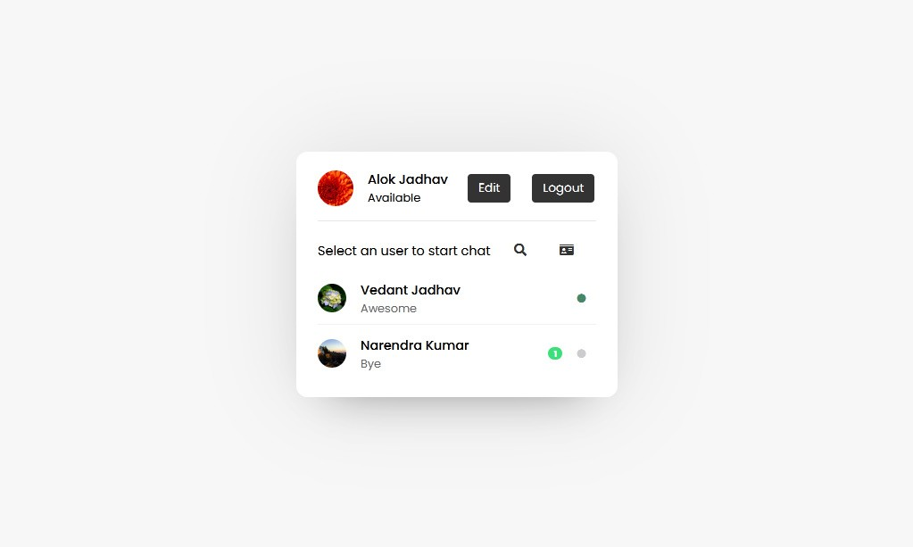
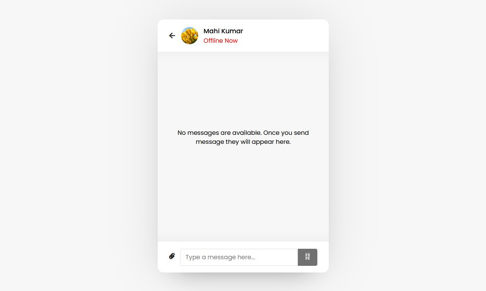
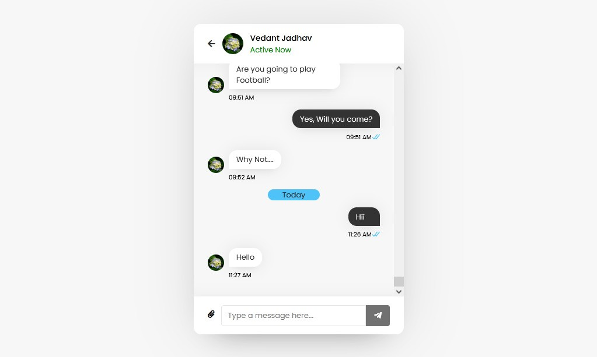
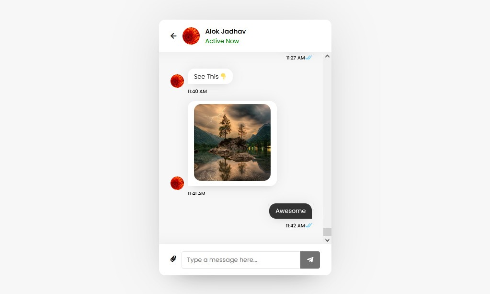
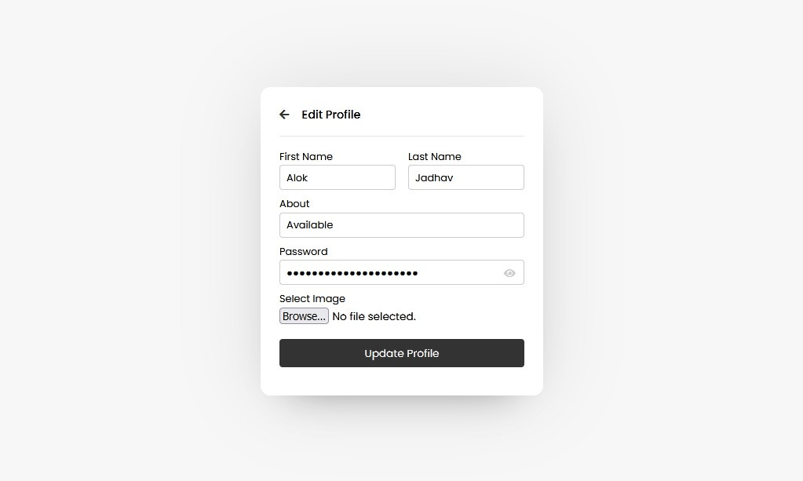

# ChatApp
It is a simple Web-Based Chat Application using HTML, PHP, CSS, JavaScript, Ajax.

In this chat application, when you open it first on your browser, there is shown a signup form where you have to signup with your details like name, email, password, and image. Email and image field is fully validated which means you’ve to enter a valid email and an image file only. 

Once you signed up successfully, you’ll be redirected to the user’s page where you can see your full name, image, status, and logout button to the top, and users, like you, appear on the bottom if someone has signed up.

## How to Run This Project
Follow the steps below should be performed after you’ve started Apache and MySQL server in XAMPP.
- Extract the File.
- Copy the Main project folder Paste into C:\xampp\htdocs\
- Open a browser and go to URL http://localhost/phpmyadmin/
- Then, click on the databases tab
- Create a database naming "chatapp.sql" and then click on the import tab
- Click on browse file and select "chatapp.sql" file which is inside the folder
- Click on go.
- After Creating Database,
- Open a browser and go to URL http://localhost/ChatApp/

Note : Don't Forgot to add mail credentials to php/resetmail.php and php/verifymail.php

## Screenshots

## Developed By
- Swarup Kanade [@swarupkanade](https://www.github.com/swarupkanade)
- Omkar Kanade [@omkarkanade](https://www.github.com/omkarkanade)